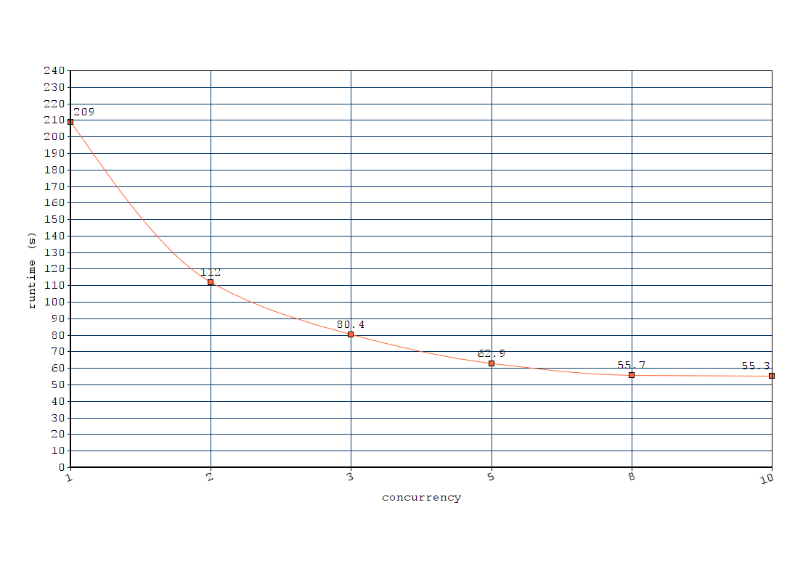

[](https://badge.fury.io/py/grobid_client_python)
[](https://archive.softwareheritage.org/browse/origin/https://github.com/kermitt2/grobid_client_python/)
[](http://www.apache.org/licenses/LICENSE-2.0.html)

# Simple python client for GROBID REST services

This Python client can be used to process in an efficient concurrent manner a set of PDF in a given directory by the [GROBID](https://github.com/kermitt2/grobid) service. It includes a command line for processing PDF on a file system and write results in a given output directory and a library for import in other python scripts. The client can also process similarly a list of files with reference strings (one per line).

## Before you start

Please be aware that, at the moment, [grobid does not support Windows](https://grobid.readthedocs.io/en/latest/Troubleshooting/#windows-related-issues).
If you are a Windows user, don't worry. You can still [run grobid 
via Docker](https://grobid.readthedocs.io/en/latest/Grobid-docker/).

## Build and run

You need first a running *grobid* service, latest stable version, see the [documentation](http://grobid.readthedocs.io/) for installation. 
By default, it is assumed that the server will run on the address `http://localhost:8070`. 
You can change the server address by editing the file `config.json`, see below.

## Requirements

This client has been developed and was tested with Python `3.5`-`3.8` and should work with any higher `3.*` versions. It does not require any dependencies beyond the standard Python ones.

## Install

Get the github repo:

```console
git clone https://github.com/kermitt2/grobid_client_python
cd grobid_client_python
python3 setup.py install
```

There is nothing more needed to start using the python command lines, see the next section. 


## Usage and options

```
usage: grobid_client [-h] [--input INPUT] [--output OUTPUT] [--config CONFIG]
                     [--n N] [--generateIDs] [--consolidate_header]
                     [--consolidate_citations] [--include_raw_citations]
                     [--include_raw_affiliations] [--force] [--teiCoordinates]
                     [--verbose]
                     service

Client for GROBID services

positional arguments:
  service               one of ['processFulltextDocument',
                        'processHeaderDocument', 'processReferences',
                        'processCitationList']

optional arguments:
  -h, --help            show this help message and exit
  --input INPUT         path to the directory containing PDF files or .txt
                        (for processCitationList only, one reference per line)
                        to process
  --output OUTPUT       path to the directory where to put the results
                        (optional)
  --config CONFIG       path to the config file, default is ./config.json
  --n N                 concurrency for service usage
  --generateIDs         generate random xml:id to textual XML elements of the
                        result files
  --consolidate_header  call GROBID with consolidation of the metadata
                        extracted from the header
  --consolidate_citations
                        call GROBID with consolidation of the extracted
                        bibliographical references
  --include_raw_citations
                        call GROBID requesting the extraction of raw citations
  --include_raw_affiliations
                        call GROBID requestiong the extraciton of raw
                        affiliations
  --force               force re-processing pdf input files when tei output
                        files already exist
  --teiCoordinates      add the original PDF coordinates (bounding boxes) to
                        the extracted elements
  --segmentSentences    segment sentences in the text content of the document
                        with additional <s> elements
  --verbose             print information about processed files in the console


```

Examples:

```console
> grobid_client --input ~/tmp/in2 --output ~/tmp/out processFulltextDocument
```

This command will process all the PDF files present under the input directory recursively (files with extension `.pdf` only) with the `processFulltextDocument` service of GROBID, and write the resulting XML TEI files under the output directory, reusing the file name with a different file extension (`.grobid.tei.xml`), using the default `10` concurrent workers. 

If `--output` is omitted, the resulting XML TEI documents will be produced alongside the PDF in the `--input` directory.

```console
> grobid_client --input ~/tmp/in2 --output ~/tmp/out --n 20 processHeaderDocument
```

This command will process all the PDF files present in the input directory (files with extension `.pdf` only) with the `processHeaderDocument` service of GROBID, and write the resulting XML TEI files under the output directory, reusing the file name with a different file extension (`.grobid.tei.xml`), using `20` concurrent workers. 

By default if an existing `.grobid.tei.xml` file is present in the output directory corresponding to a PDF in the input directory, this PDF will be skipped to avoid reprocessing several times the same PDF. To force the processing of PDF and over-write of existing TEI files, use the parameter `--force`.   

`processCitationList` does not take a repertory of PDF as input, but a repertory of `.txt` files, with one reference raw string per line, for example:

```console
> grobid_client --input resources/test_txt/ --output resources/test_out/ --n 20 processCitationList
```

The following command example will process all the PDF files present in the input directory and add bounding box coordinates (`--teiCoordinates`) relative to the original PDFs for the elements listed in the config file. It will also segment the sentences (`--segmentSentences`, this is a "layout aware" sentence segmentation) in the identified paragraphs with bounding box coordinates for the sentences. 

```console
> grobid_client --input ~/tmp/in2 --output ~/tmp/out --teiCoordinates --segmentSentences processFulltextDocument
```

The file `example.py` gives an example of usage as a library, from a another python script. 

## Using the client in your python

Import and call the client as follow:

```python
from grobid_client.grobid_client import GrobidClient

client = GrobidClient(config_path="./config.json")
client.process("processFulltextDocument", "/mnt/data/covid/pdfs", n=20)
```

See also `example.py`.

## Configuration of the client

There are a few parameters that can be set with the `config.json` file. 

- `grobid_server` indicates the URL of the GROBID server to be used by the client. 

- `batch_size` is the the size of the pool of threads used by ThreadPoolExecutor, you normally don't want to change this. This should be a high number (default 1000) - but not too high to protect the memory on the machine running the client. This should not be confused with the concurrency parameter `n` which indicates how many parallel requests can be send to GROBID.

- `sleep_time` indicates in seconds the time to wait for sending a new request to GROBID when the server indicates that all its threads are currently used. The client need to re-send the query after a wait time that will allow the server to free some threads. This wait time usually depends on the service and the capacities of the server, we suggest 5-10 seconds for the `processFulltextDocument` service and 2 seconds for `processHeaderDocument` service.

- `timeout` is a client side timeout - the process on server side will still be running until the server finished the task or the server timeout is reached.

- `coordinates` indicates the structure XML elements that should contains PDF coordinates when the parameters `--teiCoordinates` is used see [here](https://grobid.readthedocs.io/en/latest/Coordinates-in-PDF/) for more details.

Here is the default `config.json` file for the client:

```
{
    "grobid_server": "http://localhost:8070",
    "batch_size": 1000,
    "sleep_time": 5,
    "timeout": 60,
    "coordinates": [ "persName", "figure", "ref", "biblStruct", "formula", "s" ]
}
```

## Benchmarking

Full text processing of __136 PDF__ (total 3443 pages, in average 25 pages per PDF) on Intel Core i7-4790K CPU 4.00GHz, 4 cores (8 threads), 16GB memory, `n` being the concurrency parameter:

| n  | runtime (s)| s/PDF | PDF/s |
|----|------------|-------|-------|
| 1  | 209.0      | 1.54  | 0.65  |
| 2  | 112.0      | 0.82  | 1.21  |
| 3  | 80.4       | 0.59  | 1.69  |
| 5  | 62.9       | 0.46  | 2.16  |
| 8  | 55.7       | 0.41  | 2.44  |
| 10 | 55.3       | 0.40  | 2.45  |



As complementary info, GROBID processing of header of the 136 PDF and with `n=10` takes 3.74 s (15 times faster than the complete full text processing because only the two first pages of the PDF are considered), 36 PDF/s. 

In similar conditions, extraction and structuring of bibliographical references takes 26.9 s (5.1 PDF/s).

Processing of 3500 raw bibliographical take 4.3 s with `n=10` (814 references parsed per second).


## License and contact

Distributed under [Apache 2.0 license](http://www.apache.org/licenses/LICENSE-2.0). 

Main author and contact: Patrice Lopez (<patrice.lopez@science-miner.com>)
